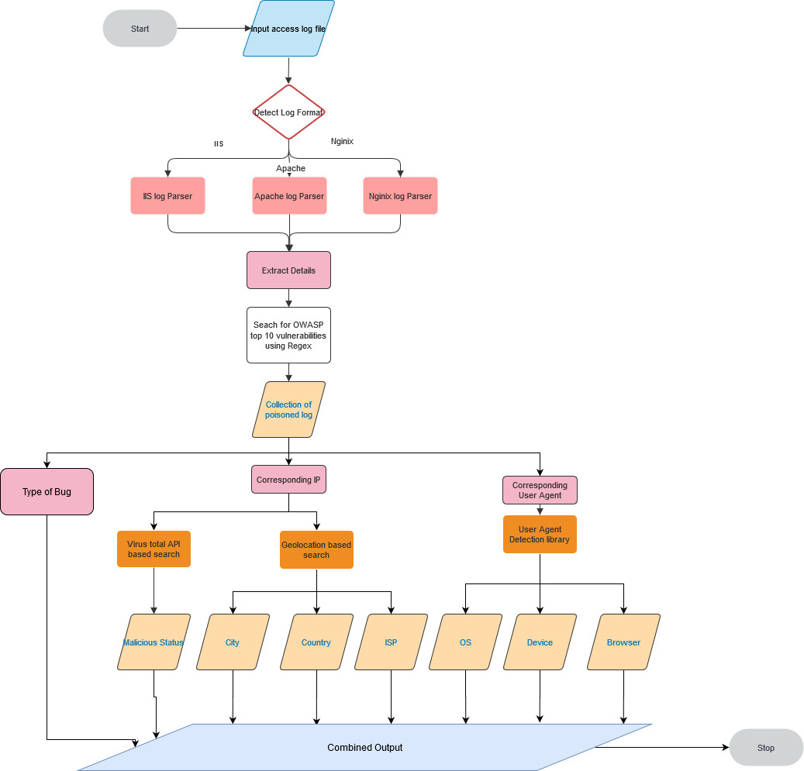

    
    

>It is a python based tool which can ease the job of manual investigation of log files. 

# Supported features:  
	-User Agent Detection: Extraction of Device Type, Operation System and Browser with its version  
	-Parsing Microsoft IIS log files  
	-Using ipinfo API: Get ISP, Country and City.  
	-Generate the output to a CSV File  
# Logbeast Version 1.0 prototype
>Initial Release - Genesis Release 

    
    

This project was part of Hac'KP Kerala Police Cyberdome Hackathon 2020.
